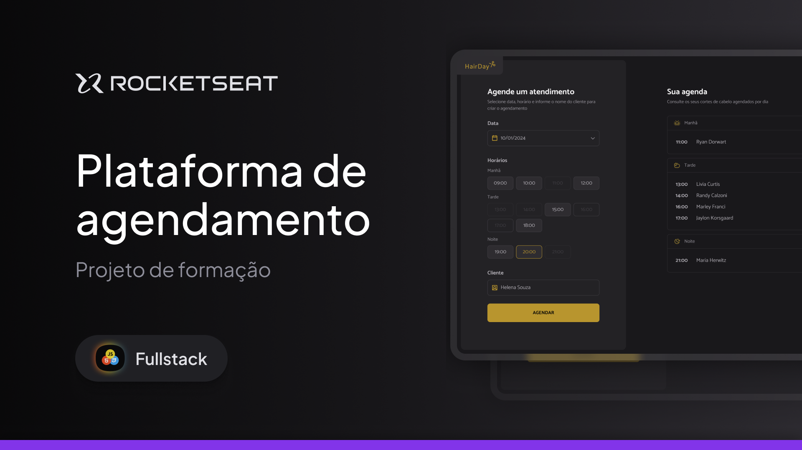

# Projeto Hair Day

  
    

## Sobre:

Projeto desenvolvido durante a formação **Full Stack** da **Rocketseat**.

O Hair Day permite os cabeleireiros gerenciarem os agendamentos para cortes.

## Tecnologias:

- Figma;
- HTML e CSS;
- Javascript;

## Tópicos:

- Webpack;
- Webpack Server;
- Babel;
- Pacote day.js;
- Pacote json-server;
- Integração com API;
